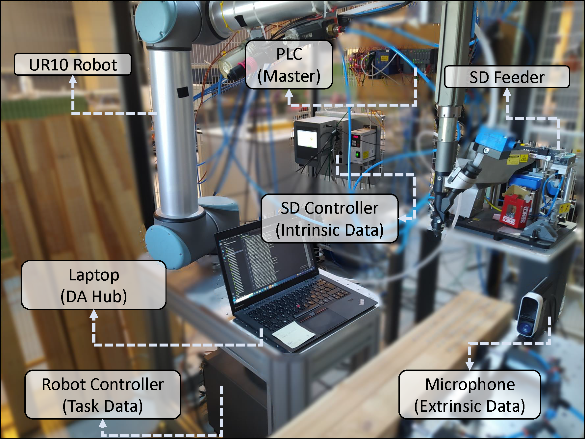
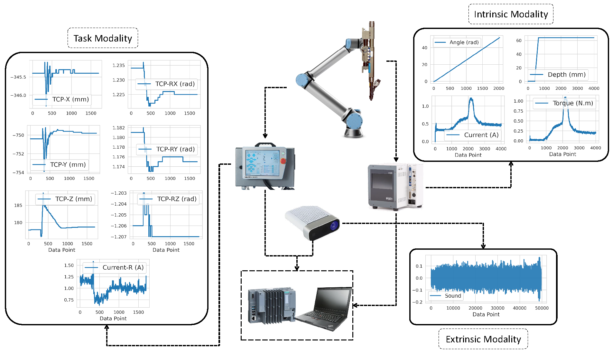

# LST-MADNet

**Learnable Scattering Transform Network for Multimodal Anomaly Detection in Industrial Manufacturing**

> **Paper (SSRN)**: [here](https://papers.ssrn.com/sol3/papers.cfm?abstract_id=5414854)
>
> **Paper (Advanced Engineering Informatics)**: Will be available soon
>
> **Dataset**: Is available upon request

LST-MADNet is a deep learning framework for detecting anomalies in multi-modal time-series data from industrial manufacturing systems. It introduces a **Learnable Scattering Transform (LST) layer** — a differentiable wavelet-based feature extractor — combined with convolutional neural networks to classify process anomalies from heterogeneous sensor data.

The framework supports:
- **Single-modal** anomaly detection (LSTN)
- **Multi-modal** anomaly detection with three fusion strategies:
  - Early Fusion (LST-MADNet-EF)
  - Late Fusion (LST-MADNet-LF)
  - Deep Fusion (LST-MADNet-DF)

---

## Architecture

### LSTLayer1D — Learnable Scattering Transform

The core building block is the `LSTLayer1D`, which applies a learnable wavelet scattering transform to 1D time-series signals:

1. **Wavelet Transform**: Convolves the input with a bank of parameterized Morlet wavelets at multiple learnable scales.
2. **Modulus Operation**: Computes the energy (squared modulus) of the complex wavelet response.
3. **Low-Pass Filtering**: Smooths the modulus coefficients with a Gaussian kernel.

The wavelet scales are **learnable parameters** optimized during training via backpropagation.

### LSTN — Single-Modal Network

For single-channel anomaly detection:

```
Input (B, 1, L)
  → LSTLayer1D
  → [BatchNorm1D]
  → Conv2D → ReLU → MaxPool2D → [BatchNorm2D]
  → Conv2D → ReLU → MaxPool2D → [BatchNorm2D]
  → Flatten → FC → ReLU → FC → ReLU → FC
  → Logits (B, num_classes)
```

### LST-MADNet-EF — Early Fusion

All channels are individually normalized and concatenated along the time axis into a single long signal, then processed by a standard LSTN.

```
Channel 1 (B, 1, L₁) → Normalize ─┐
Channel 2 (B, 1, L₂) → Normalize ─┼→ Concat along time → LSTN → Logits (B, C)
Channel N (B, 1, Lₙ) → Normalize ─┘
```

### LST-MADNet-LF — Late Fusion

Each channel is processed by an independent LSTNLF feature extractor. The resulting feature vectors are concatenated and passed through fully connected layers.

```
Channel 1 (B, 1, L₁) → LSTNLF Head 1 → features₁ ─┐
Channel 2 (B, 1, L₂) → LSTNLF Head 2 → features₂ ─┼→ Concat → FC → FC → FC → Logits (B, C)
Channel N (B, 1, Lₙ) → LSTNLF Head N → featuresₙ ─┘
```

### LST-MADNet-DF — Deep Fusion

Each channel is processed by an independent LSTLayer1D. The resulting time-frequency representations (TFRs) are resized to a common dimension and stacked, then processed by shared convolutional layers.

```
Channel 1 (B, 1, L₁) → LSTLayer1D → TFR₁ ─┐
Channel 2 (B, 1, L₂) → LSTLayer1D → TFR₂ ─┼→ Resize & Stack
Channel N (B, 1, Lₙ) → LSTLayer1D → TFRₙ ─┘        │
                                                      ↓
                                Conv2D → ReLU → MaxPool2D → [BatchNorm2D]
                              → Conv2D → ReLU → MaxPool2D → [BatchNorm2D]
                              → Flatten → FC → ReLU → FC → ReLU → FC
                              → Logits (B, C)
```

---

## Installation

### From source

```bash
git clone https://github.com/MoZaKeri/LST-MADNet.git
cd LST-MADNet
pip install -e .
```

### Dependencies only

```bash
pip install -r requirements.txt
```

### Requirements

- Python >= 3.9
- PyTorch >= 2.0
- CUDA (optional, for GPU acceleration)

---

## Quick Start

### Single-Modal Training (LSTN)

```python
import torch
from torch.utils.data import DataLoader
from lstmadnet import LSTN, TriScrewSense, train_model

# Load data
dataset_tr = TriScrewSense(dataset_path="data/splitted/intrinsic_tr.parquet",
                           target_feature="torque",
                           target_length=1408)
dataset_val = TriScrewSense(dataset_path="data/splitted/intrinsic_val.parquet",
                            target_feature="torque",
                            target_length=1408)

dataloader_tr = DataLoader(dataset_tr, batch_size=32, shuffle=True, drop_last=True)
dataloader_val = DataLoader(dataset_val, batch_size=32, shuffle=False)

# Define model
model_config = {
    "signal_size": 1408,
    "stlayer_config": {
        "scale_min": 0.1, "scale_max": 10.0, "num_scales": 16,
        "kernel_ratio": 0.1, "stride_ratio": 0.5,
        "kernel_ratio_lp": 0.1, "stride_ratio_lp": 0.5,
    },
    "conv1_config": {"out_channels": 6, "kernel_ratio": [0.5, 0.2], "stride_ratio": [0.5, 0.5]},
    "pool1_config": {"kernel_ratio": [0.5, 0.5], "stride_ratio": [0.5, 0.5]},
    "conv2_config": {"out_channels": 16, "kernel_ratio": [0.5, 0.2], "stride_ratio": [0.5, 0.5]},
    "pool2_config": {"kernel_ratio": [0.5, 0.5], "stride_ratio": [0.5, 0.5]},
    "linear_config": {"hidden1_ratio": 0.5, "hidden2_ratio": 0.5, "num_classes": 4},
}

model = LSTN(**model_config)

# Train
from torcheval.metrics.functional import multiclass_accuracy
report, _ = train_model(
    model=model,
    dataloader_tr=dataloader_tr,
    dataloader_val=dataloader_val,
    n_epochs=25,
    optim_fcn=torch.optim.SGD(model.parameters(), lr=0.01),
    loss_fcn=torch.nn.CrossEntropyLoss(),
    acc_fcn=multiclass_accuracy,
    device="cuda",
)
```

### Multi-Modal Training (Late Fusion)

```python
from lstmadnet import LSTMADNetLF, TriScrewSenseLF, train_model

# Load multi-modal data
dataset_tr = TriScrewSenseLF(
    data_dir="data/splitted/",
    training=True,
    target_features={"intrinsic": ["torque"], "task": ["tcp_x"], "extrinsic": ["sound"]},
)

# Define model with per-channel configs
channels = dataset_tr.channels  # ["torque", "tcp_x", "sound"]
model = LSTMADNetLF(
    channels=channels,
    signal_sizes={"torque": 1408, "tcp_x": 463, "sound": 34816},
    stlayer_configs={ch: stlayer_config for ch in channels},  # per-channel configs
    conv1_configs={ch: conv1_config for ch in channels},
    pool1_configs={ch: pool1_config for ch in channels},
    conv2_configs={ch: conv2_config for ch in channels},
    pool2_configs={ch: pool2_config for ch in channels},
    batch_norms={ch: True for ch in channels},
    linear_config={"hidden1_ratio": 0.5, "hidden2_ratio": 0.5, "num_classes": 4},
)
```

### Evaluation

```python
from lstmadnet import evaluate_model

report = evaluate_model(model=model, dataset=dataset_val, verbose=True)
print(f"Accuracy: {report['acc']:.4f}")
print(f"F1 Score: {report['f1']:.4f}")
print(f"ROC AUC:  {report['roc']:.4f}")
```

---

## Dataset

The framework was developed and evaluated on the **TriScrewSense** dataset — a multi-modal dataset collected from an industrial screw-driving cell.

> **Download**: [TODO: Add link to dataset]

<p align="center">
  
  <br><em>Screw-driving cell setup</em>
</p>

<p align="center">
  
  <br><em>Multi-modal sensor data overview</em>
</p>

### Data Format

The framework expects data in **Parquet** format with the following schema:

| Column | Type | Description |
|--------|------|-------------|
| `id` | int | Sample identifier (groups rows belonging to one process cycle) |
| `process_id` | str | Original process file identifier |
| `label` | int | Class label (0=normal, 1=under-tightening, 2=over-tightening, 3=missing screw) |
| *feature columns* | float | Time-series measurements (e.g., `torque`, `current`, `tcp_x`, `sound`) |

Each modality has its own Parquet file:
- **Intrinsic** (`intrinsic_tr.parquet`): torque, current, angle, depth
- **Task** (`task_tr.parquet`): tcp_x, tcp_y, tcp_z, tcp_rx, tcp_ry, tcp_rz, current
- **Extrinsic** (`extrinsic_tr.parquet`): sound

---

## Project Structure

```
LST-MADNet/
├── lstmadnet/          # Core Python package
│   ├── __init__.py     # Package exports
│   ├── nn.py           # Model architectures (LSTLayer1D, LSTN, LSTMADNetLF, LSTMADNetDF)
│   ├── train.py        # Training loop with W&B integration
│   ├── eval.py         # Evaluation pipeline (metrics + reporting)
│   ├── data.py         # Dataset classes and data utilities
│   ├── plot.py         # Visualization utilities
│   └── tune.py         # Hyperparameter tuning with W&B sweeps
├── configs/            # Example configuration files
│   ├── single_modal.yaml
│   ├── early_fusion.yaml
│   ├── late_fusion.yaml
│   └── deep_fusion.yaml
├── docs/figures/       # Figures
├── pyproject.toml      # Package metadata and dependencies
├── requirements.txt    # Pip dependencies
├── LICENSE             # MIT License
└── README.md
```

---

## Model Variants

| Model | Class | Input | Use Case |
|-------|-------|-------|----------|
| LSTN | `LSTN` | Single channel `(B, 1, L)` | Per-sensor anomaly detection |
| LST-MADNet-EF | `LSTN` + `TriScrewSenseEF` | Concatenated channels `(B, 1, L_total)` | Simple multi-modal baseline |
| LST-MADNet-LF | `LSTMADNetLF` | Dict of channels `{name: (B, 1, L_i)}` | Independent feature extraction per modality |
| LST-MADNet-DF | `LSTMADNetDF` | Dict of channels `{name: (B, 1, L_i)}` | Shared spatial processing on fused TFRs |

---

## Configuration

All hyperparameters are specified via dictionary configs. See `configs/` for complete examples.

Key design choice: **ratio-based sizing**. Kernel sizes and strides are specified as ratios (0, 1) of the input dimensions, making the architecture adaptive to different signal lengths without manual tuning.

---

## Citation

If you use this code in your research, please cite:

> **Paper**: [TODO: Add citation once published]

```bibtex
@software{zakeriharandi2025lstmadnet,
  author = {Zakeriharandi, Mohammadali},
  title = {LST-MADNet: Learnable Scattering Transform for Multimodal Anomaly Detection},
  year = {2025},
  url = {https://github.com/MoZaKeri/LST-MADNet},
  license = {MIT}
}
```

---

## License

This project is licensed under the MIT License — see the [LICENSE](LICENSE) file for details.
